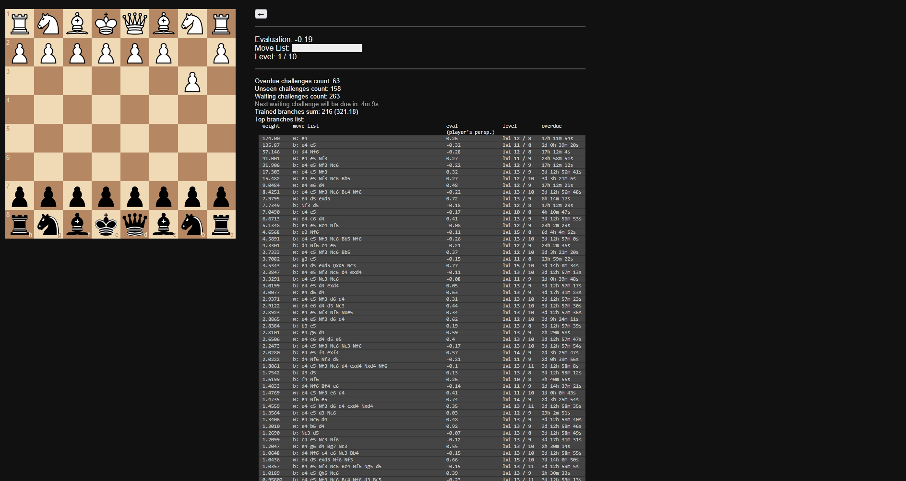

# Stockfish Spaced Opening Trainer

A highly opinionated chess opening trainer built for personal use.

This is a Next.js application that uses Stockfish to generate and drill opening positions using spaced repetition. It deliberately ignores opening names and explanations, and focuses only on engine evaluation and move popularity (via the Lichess API).

The goal is not to memorize theory, but to build intuition by repeatedly finding the single move Stockfish considers best in a given position.



## How it works

On first run, the application initializes a set of challenges:

- One starting position where you play White
- Twenty starting positions where you play Black (one for each legal first move by White)

For each position, Stockfish evaluates the position at a fixed search depth and selects the best move.

Positions are discarded if:
- the player's side is already winning, or
- the position has low popularity (based on Lichess game percentages)

The remaining positions are ordered and presented as training challenges.

Each challenge requires you to play the *exact* move Stockfish considers best. Any other move is treated as a mistake, even if it is strong and reasonable.

Challenges use a spaced repetition system. Successful attempts increase a challenge's level, mistakes decrease it. The level determines how long it will be before the challenge appears again.

Once a challenge reaches a sufficiently high level, it is expanded. All opponent replies are generated, clearly bad moves are discarded, and the resulting positions become new challenges.

Over time, this grows single-move drills into deeper opening trees, but only along lines where both sides play sensibly according to the engine.

## Non-goals

This project intentionally does not:
- teach opening names or classifications
- accept "good enough" moves
- explain *why* a move is good

If a move is not the best move according to Stockfish, it is treated as incorrect.

## Running locally

Requirements:
- Node.js
- Stockfish (installed locally)
- Internet connection (for move popularity data)

Before running, update the Stockfish path and settings in `app/lib/config.js`. This repo contains multiple cached evaluations, so for early positions Stockfish won't be used.

Clone the repository and run:

```
npm install
npm run dev
```